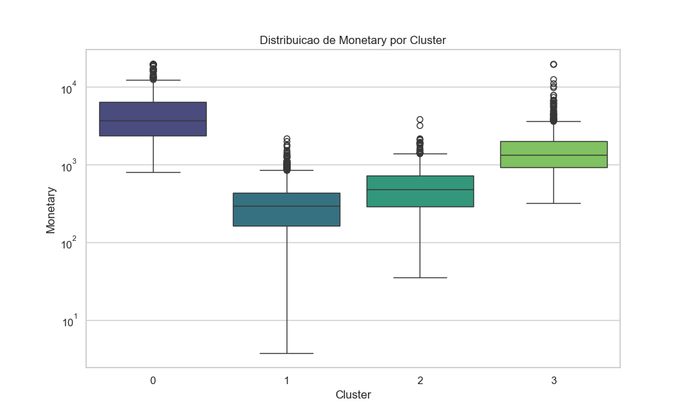

# Consumer Profiling & Behavioral Clustering
**Author:** Ewerton Florencio  
**LinkedIn:** [https://www.linkedin.com/in/ewertonfl/](https://www.linkedin.com/in/ewertonfl/)


---

## 📘 Project Overview

This project performs **customer segmentation** using a combination of:
- **RFM Analysis** (Recency, Frequency, Monetary)
- **Unsupervised Machine Learning** (K-Means)
- Data Cleaning & Feature Engineering
- Exploratory Data Analysis (EDA)

The objective is to build a **market-relevant**, **realistic**, and **fully reproducible** Data Science pipeline that demonstrates both **Data Engineering** and **Machine Learning** capabilities.

---

## 📂 Documentation

Detailed documentation for technical and business stakeholders:
*   [📄 Functional Specifications](docs/functional_specs.pdf) - Business context and goals.
*   [⚙️ Technical Specifications](docs/technical_specs.pdf) - Architecture and implementation details.
*   [📖 Data Dictionary](docs/data_dictionary.pdf) - Field definitions for Raw, Silver, and Gold layers.
*   [✅ Test Plan](docs/test_plan.pdf) - Test Plan.

---

## 🏗️ Architecture & Pipeline

The project follows the **Medallion Architecture**:

```markdown
graph LR
    A[Raw Data (CSV/Excel)] -->|Cleaning| B(Silver Layer)
    B -->|Feature Eng| C(Gold Layer - RFM)
    C -->|K-Means| D[Final Clusters]
```

- **Raw:** Original transaction data.
- **Silver:** Cleaned data (deduplicated, standardized).
- **Gold:** Customer-level RFM metrics.
- **Output:** Labeled clusters with business interpretation.

---

## 📊 Business Insights & Results

The model identified **4 distinct customer profiles** (Clusters). Below is the business interpretation based on the centroids:

| Cluster | Profile Name | Characteristics | Business Recommendation |
| :--- | :--- | :--- | :--- |
| **0** | **Champions (VIPs)** | High Spend, High Frequency, Very Recent. | **Priority:** Create exclusive loyalty program; Early access to new products. |
| **1** | **Hibernating** | Low Spend, Low Frequency, High Recency (>200 days). | **Reactivation:** Aggressive discount campaigns or database cleanup. |
| **2** | **New / Promising** | Recent purchase, Low Frequency, Medium Spend. | **Nurturing:** Onboarding emails to encourage the second purchase. |
| **3** | **Loyal / At Risk** | Good Spend/Frequency, but Recency is slipping (30-80 days). | **Retention:** "We miss you" coupons to prevent churn. |

> *Note: Cluster IDs may vary slightly depending on the random state re-run, but the profiles remain consistent.*

### Visual Analysis
*(Generated automatically in `docs/img/`)*

*Distribution of Monetary Value per Cluster*

---

## ⚙️ Installation & Setup

### **1. Clone the repository**
```bash
git clone https://github.com/ewertonfl/consumer-segmentation-rfm.git
cd consumer-segmentation-rfm
```

### **2. Setup Environment**
It is recommended to use a virtual environment:
```bash
# Using Makefile (Linux/Mac/Git Bash)
make setup

# OR Manually (Windows)
python -m venv venv
venv\Scripts\activate
pip install -r requirements.txt
```

### **3. Download Data (Crucial Step)**
Due to GitHub size limits, the dataset is not included.
1. Download **"Online Retail"** from [UCI Machine Learning Repo](https://archive.ics.uci.edu/ml/datasets/online+retail) or Kaggle.
2. Rename the file to **`online_retail.xlsx`**.
3. Place it in: **`data/raw/online_retail.xlsx`**.

---

## ▶️ Running the Pipeline

### **Run full pipeline**
Executes Ingestion → Cleaning → RFM Calculation → Clustering → Reporting.
```bash
# Via Makefile
make run

# OR Manually
python -m src.pipeline
```

### **Run Tests**
Validates data quality rules and RFM math.
```bash
# Via Makefile
make test

# OR Manually
pytest tests/
```

---

## 📁 Repository Structure

```text
consumer-segmentation-rfm/
│
├── data/                      # Local storage (Git ignored)
│   ├── raw/                   # Input file goes here
│   ├── silver/                # Cleaned Parquet/CSV
│   └── gold/                  # Final RFM Table
│
├── docs/                      # Documentation & Images
├── notebooks/                 # Jupyter Notebooks for EDA
├── src/                       # Source Code
│   ├── pipeline.py            # Main Orchestrator
│   ├── preprocessing.py       # Silver Layer Logic
│   ├── feature_engineering.py # Gold Layer (RFM) Logic
│   ├── clustering.py          # K-Means Model
│   └── visualization.py       # Plot generation
│
├── tests/                     # Unit Tests
├── Makefile                   # Automation commands
└── requirements.txt           # Dependencies
```

---

## 🤝 Contact
**Ewerton Florencio**  
[LinkedIn Profile](https://www.linkedin.com/in/ewertonfl/)
